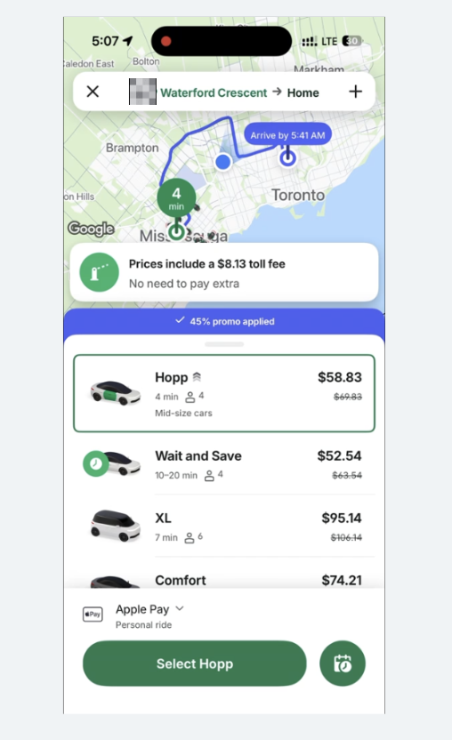
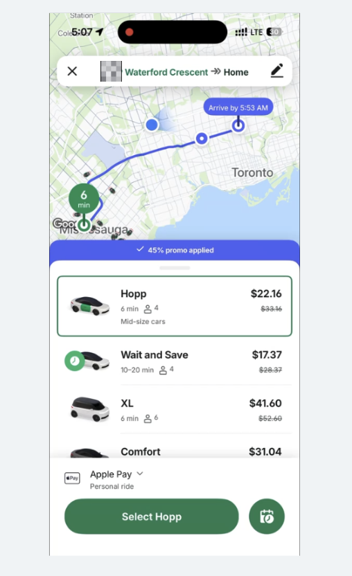

# Algorithmic Pricing Loophole Simulator: The Surge Floor Fix

## Project Overview
This repository contains a simple, interactive simulation demonstrating a real-world **algorithmic pricing loophole** observed in major ride-sharing and logistics platforms.  
The core problem arises when a system designed to maximize efficiency (speed/convenience) is manipulated by introducing a **detour (a “midpoint”)**, forcing the algorithm onto a **non-premium route** that is severely under-surged during peak demand.

The solution demonstrated is the implementation of a **Surge Floor** — a mandatory minimum multiplier that prevents the price from collapsing and ensures consistent peak-hour revenue.

---

## The Files

This project consists of two core files that run independently to demonstrate the logic:

### `index.html` (Simulator)
A single-file, interactive web application built with **HTML**, **Tailwind CSS**, and **JavaScript**.

- Allows users to adjust variables (Base Rate, Multipliers, Surge Floor) and switch between the **Direct Trip (Premium)** and the **Midpoint Trip (Loophole)** scenarios.  
- Includes a dynamic chart to visually break down the final fare components (**Base Cost**, **Toll**, **Surge/Discount**).  
- Demonstrates the difference between the broken and fixed pricing logic.

### `fare_calculator.py` (Backend Logic)
A runnable Python script that contains the exact pricing functions (`calculate_base_fare`, `apply_surge_and_toll`).

It runs two demos:
1. Shows the initial, **broken state** (large fare difference).  
2. Shows the **fixed state** (Surge Floor applied).

---

## Loophole Mechanics Explained

The loophole exploits a conflict in the cost function’s weighting:

### Scenario A — Direct Trip
The algorithm chooses the fastest, premium route (e.g., using a toll highway).  
This route is priced with a **high multiplier (≈1.70×)** to account for speed, convenience, and peak demand.  
**High Price:** ≈ $106

### Scenario B — Midpoint Trip
The user adds an unnecessary stop (midpoint).  
This forces the routing algorithm to select a different, **non-premium route** (e.g., a free highway) to optimize the multi-stop journey.

**The Flaw:** The algorithm incorrectly applies a **low surge multiplier (≈0.75×)** to this non-premium route, resulting in a **pricing collapse** even though the trip still occurs during peak hours.  
**Low Price:** ≈ $40

This occurs because the system prioritizes the non-toll path when the toll route becomes inefficient due to the midpoint.

---

## Visual Reference: Real-World Case

Below are the actual screenshots from the ride-sharing app that revealed the loophole:

### Screenshot 1 — Direct Trip (High Fare)


### Screenshot 2 — Midpoint Trip (Reduced Fare)


After adding a single midpoint stop, the fare dropped by more than 60% — even though the total travel distance slightly increased.  
This inspired the creation of the **Surge Floor Fix** algorithm.

---

## The Solution: Surge Floor

To resolve the inconsistency, a Surge Floor was introduced — a minimum surge multiplier applied to non-toll routes during peak hours.  
This ensures that even if the route changes to avoid a toll, the fare remains aligned with real-time demand instead of collapsing to an artificially low value.

In practical terms, the Surge Floor keeps the system fair for both the rider and the platform:
- **Riders** still benefit from cheaper non-toll routes.
- **Drivers and the platform** avoid revenue loss during peak-hour demand surges.

The fix improves stability across all route calculations by ensuring consistent weighting between:
- **Speed and route efficiency**
- **Surge multiplier adjustments**
- **Peak-hour consistency**

---

## How to Run

### 1. Web Simulator (`index.html`)
Open the file in any modern browser.

**View the Loophole**
1. Click **Midpoint Trip (Loophole)**.  
2. Leave **Apply Surge Floor** unchecked.  
3. Observe the price collapse.

**View the Fix**
1. Check **Apply Surge Floor**.  
2. Observe the price increase to a consistent, peak-hour level.

---

### 2. Python Demo (`fare_calculator.py`)
Run the script in your terminal:
```bash
python fare_calculator.py

